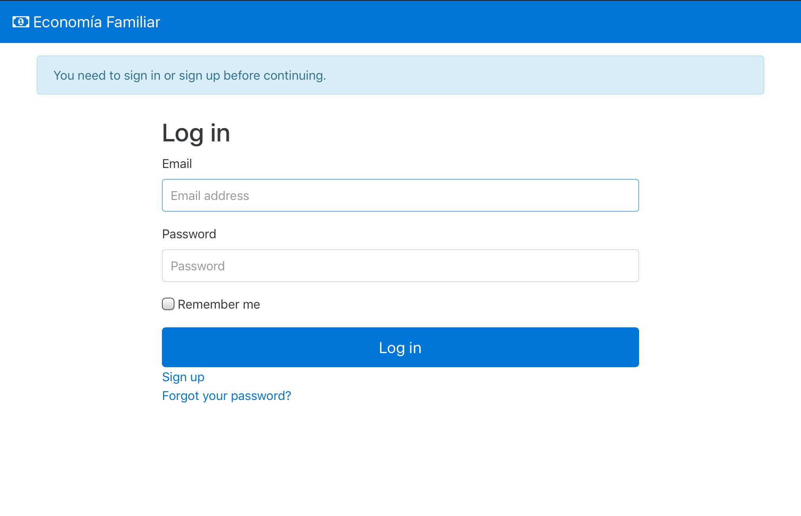

# EconomíaFamiliar

EconomíaFamiliar es una aplicación web desarrollada con un propósito muy concreto: importar los movimientos bancarios de diferentes cuentas bancarias y visualizarlos de forma unificada con una serie de informes predefinidos.

La importación de movimientos se realiza a partir de los ficheros que pueden descargarse de la parte privada de estas entidades:
* Santander
* Bankinter
 
## ¿Como puedo usar esta aplicación?

En primer lugar puedes echarle un vistazo a esta [demo](http://economiafamiliar-demo.herokuapp.com).

Pero si prefieres trastear con el proyecto lo mejor es clonar 😛😛😛:

	$ git clone git://github.com/RailsApps/rails-bootstrap.git
	
Cuando haya terminado de copiarse todo el proyecto, accede a la carpeta del mismo y realiza unos pocos pasos para terminar la instalación. El primero de ellos es la creación de la base de datos

	$ rails db:migrate
	
Como la aplicación requiere de autenticación necesitarás unos usuarios. El fichero `db/seeds.rb` contiene el alta de dos de ellos, un usuario normal y un administrador. Si no te gustan esas direcciones de acceso siempre puedes crearte otras... 😉 

	$ rails db:seed
	
Y ya está, solo te queda arrancar la aplicación:

	$ rails server
	
Si todo ha ido bien, cuando accedas desde un navegado a http:\\localhost:3000 veras algo como esto:

## Lenguaje, framework y dependencias

EconomíaFamiliar está desarrollada con Ruby 2.3 y Ruby on Rails 5.0.0.1. Si queréis más información sobre este framework de desarrollo podéis hartaros de leer [aqui](http://rubyonrails.org), yo solo os diré que es de las cosas más placenteras que me he encontrado a la hora de desarrollar software.

Además de las dependencias que el framework trae consigo, en este proyecto he incorporado las siguientes:

* [PostgreSQL](https://bitbucket.org/ged/ruby-pg/wiki/Home). Ruby on Rails viene preconfigurado para funcionar con SQLite, una base de datos sorprendente por su poco tamaño y su excelente rendimiento, pero si al final decides desplegar en un sitio como [Heroku](https://www.heroku.com/) necesitarás una base de datos más *potente*. Porque yo normalmente suelo utilizar Heroku y porque es la madre de todas las bases de datos relacionales, en el entorno de *Producción* esta aplicación usa [PostgreSQL](https://www.postgresql.org/)

* [RailsAdmin](https://github.com/sferik/rails_admin). En ocasiones viene muy bien tener un panel de control de todas las entidades que forman la base de datos para realizar algunas operaciones de mantenimiento (consulta, edición, borrado, copia de seguriad, exportación).

* [devise](https://github.com/plataformatec/devise). Se encarga de la autenticación y la gestión de usuarios. Aunque en este proyecto no lo uso de esta manera podría encargarse perfectamente del registro de nuevos usuarios con envío de mails de confirmación y de recuperación de contraseña.

* [CanCanCan](https://github.com/CanCanCommunity/cancancan). Si tenemos usuarios tendremos que definir que es lo que pueden hacer esos usuarios: unos podrán acceder al panel de administración, otros podrán solamente consultar los informes... esta gema se encarga de controlar que puede hacer cada usuario

* [Bootstrap 4.0](https://github.com/twbs/bootstrap-rubygem). Si eres un pésimo diseñador Bootstrap hará que tus aplicaciones sean un poco más aparentes.

* [Font Awesome](https://github.com/bokmann/font-awesome-rails). A ver como si no iba a poder sacar el billetito ese junto al nombre de la aplicación.

* [rubyXL](https://github.com/weshatheleopard/rubyXL). Para poder leer y escribir los ficheros xlsx.

* [Pivot Table](https://github.com/edjames/pivot_table). Hacer un group by es fácil y mola... pero pintarlo es harina de otro costal. Esta gema ha sido todo un descubrimiento.

